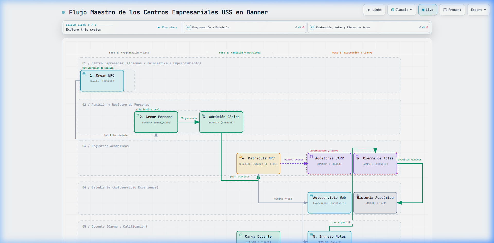
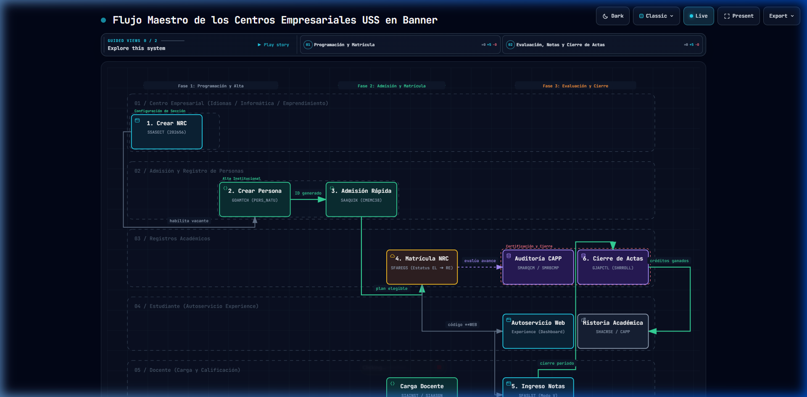
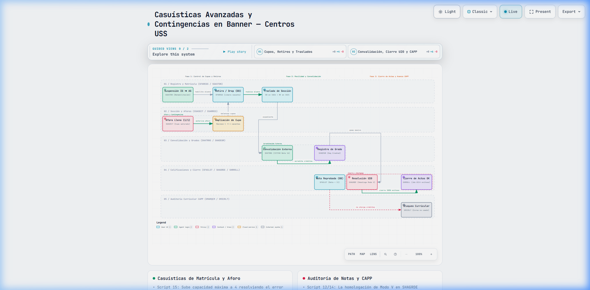
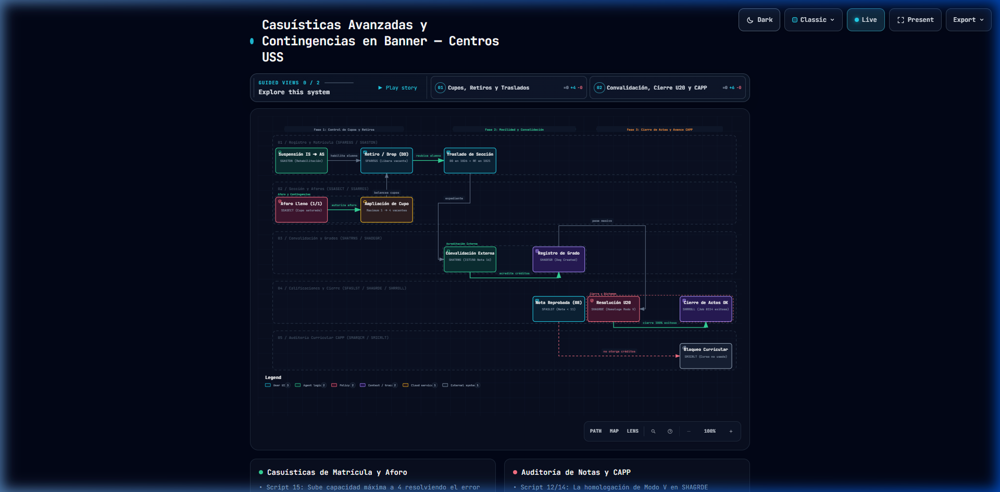

# Diagramas de Arquitectura y Flujos Operativos — Centros Empresariales USS

Este directorio contiene los diagramas interactivos y las imágenes de alta resolución de los flujos de trabajo en **Ellucian Banner Student**, generados con el motor **Archify**.

---

## 🖼️ Galería de Diagramas Generados

### 1. Flujo Maestro del Ciclo Académico (Libro 1: Pasos 1 al 6)
Cubre el recorrido de inicio a fin: Creación de NRC (`SSASECT`), Alta de Persona (`GOAMTCH`), Admisión Rápida (`SAAQUIK`), Matrícula Backoffice (`SFAREGS`), Auditoría CAPP / Autoservicio y Calificaciones con Cierre de Actas (`SHRROLL`).

* **Diagrama Interactivo HTML:** [flujo_maestro_ccee.html](file:///e:/USS/PROYECTOS/ellucian-instructivos/diagramas_flujo/flujo_maestro_ccee.html)
* **Especificación JSON:** [flujo_maestro_ccee.workflow.json](file:///e:/USS/PROYECTOS/ellucian-instructivos/diagramas_flujo/flujo_maestro_ccee.workflow.json)

| Modo Claro (Light Mode) | Modo Oscuro (Dark Mode) |
|---|---|
|  |  |

---

### 2. Casuísticas Avanzadas y Contingencias (Libro 2: Scripts de Prueba)
Cubre las contingencias validadas en TEST: Ampliación de aforo por sobrecupo (`Script 15`), Retiro / Drop con liberación de vacante (`Script 08`), Suspensión y reactivación (`Script 09`), Traslado de sección sin recargo (`Script 16`), Convalidación externa (`Script 03`), Homologación de Modo V / Resolución U20 (`Script 12/14`) y Bloqueo curricular por desaprobado en CAPP (`Script 10`).

* **Diagrama Interactivo HTML:** [casuisticas_avanzadas_ccee.html](file:///e:/USS/PROYECTOS/ellucian-instructivos/diagramas_flujo/casuisticas_avanzadas_ccee.html)
* **Especificación JSON:** [casuisticas_avanzadas_ccee.workflow.json](file:///e:/USS/PROYECTOS/ellucian-instructivos/diagramas_flujo/casuisticas_avanzadas_ccee.workflow.json)

| Modo Claro (Light Mode) | Modo Oscuro (Dark Mode) |
|---|---|
|  |  |

---

## ⚡ ¿Cómo usar los diagramas interactivos en el navegador?

Al hacer doble clic en cualquiera de los archivos `.html` (o abrirlos en Chrome / Edge):

1. **Modo Claro / Oscuro (`T`):** Presiona la tecla `T` o haz clic en el botón superior `Light / Dark` para cambiar entre modo presentación diurno o alto contraste neón.
2. **Animación de Trazas (`Live`):** Muestra el flujo en movimiento simulando el paso de transacciones y datos entre sistemas.
3. **Vistas Guiadas (`Guided Views`):** En la barra superior puedes hacer clic en `▶ Play story` o elegir capítulos para hacer zoom automático en secciones específicas del proceso.
4. **Exportación a PNG / SVG:** En el menú superior `Export`, puedes descargar en cualquier momento la imagen en formato vectorial **SVG** o mapa de bits **PNG** sin pérdida de calidad para incluirla en documentos o informes de la USS.
5. **Modo Pantalla Completa (`F`):** Presiona `F` para entrar al modo presentación ejecutiva sin barras del navegador.

---

## 🛠️ Guía Técnica: ¿Cómo crear o modificar estos diagramas con Archify?

El motor de compilación **Archify** se encuentra instalado localmente en:
`C:\Users\dagne\.gemini\config\skills\archify\bin\archify.mjs`

### 1. Estructura del Archivo de Especificación (`.workflow.json`)

Los diagramas usan la versión moderna `schema_version: 2`:

```json
{
  "schema_version": 2,
  "diagram_type": "workflow",
  "meta": {
    "title": "Título del Proceso",
    "animation": "trace",
    "quality_profile": "showcase",
    "output": "diagramas_flujo/mi_diagrama.html"
  },
  "lanes": [
    { "id": "ce", "label": "Centro Empresarial" },
    { "id": "adm", "label": "Admisión" },
    { "id": "ra", "label": "Registros Académicos" }
  ],
  "phases": [
    { "id": "p1", "label": "Fase 1: Preparación", "fromCol": 0, "toCol": 1 },
    { "id": "p2", "label": "Fase 2: Ejecución", "fromCol": 2, "toCol": 3 }
  ],
  "mainPath": ["nodo_1", "nodo_2", "nodo_3"],
  "nodes": [
    {
      "id": "nodo_1",
      "lane": "ce",
      "col": 0,
      "type": "frontend",
      "label": "1. Crear NRC",
      "sublabel": "SSASECT (Periodo 202656)",
      "tag": "Aforo y Horario",
      "width": 140
    }
  ],
  "edges": [
    {
      "id": "e-1-2",
      "from": "nodo_1",
      "to": "nodo_2",
      "label": "asigna",
      "variant": "emphasis"
    }
  ],
  "cards": [
    {
      "dot": "emerald",
      "title": "Hito Operativo",
      "items": ["Puntos clave validados en Banner TEST"]
    }
  ]
}
```

### 2. Reglas de Diseño de Archify (Buenas Prácticas)
* **Límite de Columnas:** Las columnas van de `0` a `5` (máximo 6 columnas horizontales).
* **Un nodo por columna dentro del mismo carril:** Dos nodos en el mismo `lane` no pueden compartir el mismo número de `col` (para evitar solapamientos).
* **Tipos de Nodos (`type`):**
  - `frontend`: Azul claro (pantallas de usuario / vistas web).
  - `backend`: Verde (procesos de servidor / admisiones).
  - `database`: Púrpura (cierre de actas / base de datos / historia académica).
  - `security`: Naranja / Rojo (filtros, retenciones, escalas o validaciones).
  - `cloud`: Celeste (matrícula y servicios en la nube).
  - `external`: Púrpura oscuro (estudiantes externos o egresados).
* **Consistencia de `mainPath`:** Todos los nodos listados consecutivamente en `mainPath` deben tener una arista (`edge`) que los conecte directamente.

### 3. Comando de Compilación (Render)

Para compilar cualquier archivo `.workflow.json` a un HTML interactivo listo para usar:

```powershell
node C:\Users\dagne\.gemini\config\skills\archify\bin\archify.mjs render workflow "e:\USS\PROYECTOS\ellucian-instructivos\diagramas_flujo\mi_diagrama.workflow.json" "e:\USS\PROYECTOS\ellucian-instructivos\diagramas_flujo\mi_diagrama.html"
```

El compilador valida automáticamente la geometría ortogonal, las etiquetas, los espaciados mínimos de 8px y produce el HTML autocontenido (sin dependencias externas).
